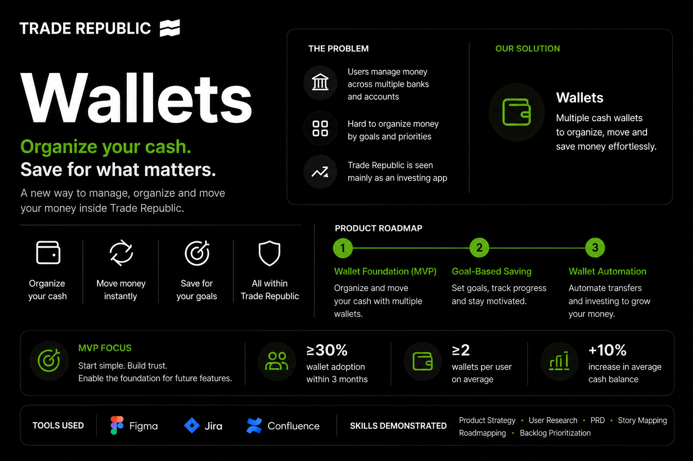
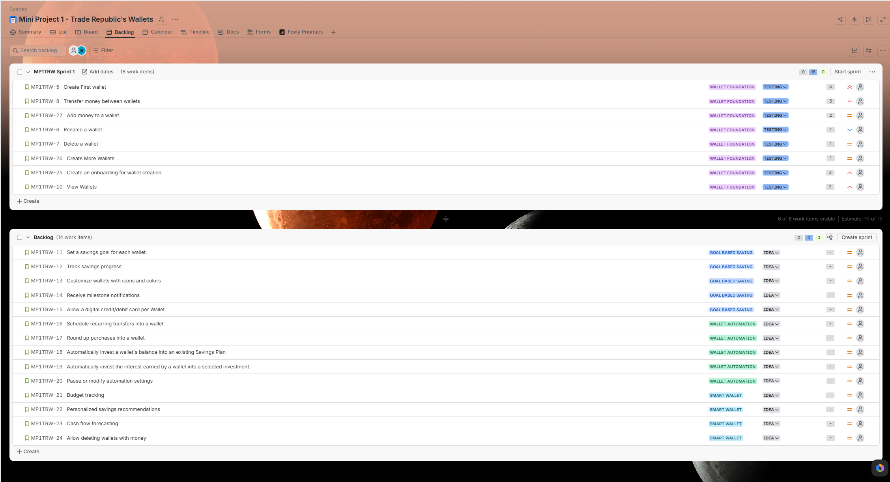

# Trade Republic Wallets – Product Management Case Study

  

A complete Product Management case study designed during the Ironhack AI Product Management Bootcamp.

This project explores how **Trade Republic** could evolve from a platform focused on investing into a more complete financial management experience by introducing **Wallets**—a feature that allows users to organise cash into multiple virtual wallets for different financial purposes.

Rather than simply proposing a feature, this project demonstrates an end-to-end Product Management process, from defining the problem to designing an MVP, prioritising features, creating a product roadmap, and validating the user experience with an interactive prototype.

> 📄 **Quick Links:** [PRD](PRD.md) • [Story Map](UserStoryMap.pdf) • [Figma Presentation](https://sl1nk.com/f9hmlry) • [Interactive Prototype](https://l1nq.com/iqzb5nl)

## 📑 Table of Contents

- [🚀 Project Overview](#-project-overview)
- [🎯 Problem Statement](#-problem-statement)
- [💡 Proposed Solution](#-proposed-solution)
- [👤 Primary User](#-primary-user)
- [🧱 MVP Scope](#-mvp-scope)
- [🗺️ Product Roadmap](#️-product-roadmap)
- [🎨 Presentation & Interactive Prototype](#-presentation--interactive-prototype)
- [📄 Project Deliverables](#-project-deliverables)
- [🛠 Product Management Skills Demonstrated](#-product-management-skills-demonstrated)
- [🧰 Tools Used](#-tools-used)
- [📸 Project Preview](#-project-preview)
- [📚 About this Project](#-about-this-project)
- [💭 Reflection](#-reflection)
- [👤 Author](#-author)

---

## 🚀 Project Overview

Many users keep their cash inside Trade Republic but still rely on external banking or budgeting apps to organise their money for different goals.

The proposed solution introduces **Wallets**, allowing users to:

- Organize cash by purpose
- Instantly transfer money between wallets
- Keep all available cash within Trade Republic
- Create a foundation for future automation and smart financial features

The project focuses on delivering a realistic MVP while demonstrating Product Management thinking, prioritisation, and product strategy.

---

## 🎯 Problem Statement

Trade Republic users currently have a single cash balance.

As a result:

- Cash cannot be separated by financial purpose.
- Users often rely on multiple banks or budgeting apps.
- Managing available cash becomes difficult as financial goals grow.

This creates friction and reduces Trade Republic's opportunity to become the user's primary financial platform.

---

## 💡 Proposed Solution

Introduce **Wallets**, allowing users to:

- Create multiple wallets inside Trade Republic
- Organize money by financial goal
- Transfer money instantly between wallets
- View and manage wallet balances in one place

The MVP focuses on building the foundation that future saving and automation features can build upon.

---

## 👤 Primary User

**Sarah**
- 28–35 years old
- Existing Trade Republic customer
- Saves for multiple financial goals
- Uses several banking apps
- Wants a simpler way to organize her money

Sarah's primary goal is to manage all her available cash inside Trade Republic without opening additional bank accounts.

---

## 🧱 MVP Scope

The MVP includes the complete Wallet foundation:

- Create Wallet
- Wallet onboarding
- View Wallets
- Add money to Wallet
- Transfer money between Wallets
- Rename Wallet
- Delete empty Wallets

The objective is to validate the core value proposition before investing in more advanced functionality.

---

## 🗺️ Product Roadmap

The roadmap extends beyond the MVP into future releases.

### MVP
Build the Wallet foundation.

### Release 2
Goal-Based Saving

Examples:
- Savings goals
- Progress tracking
- Wallet customization
- Milestone notifications

### Release 3
Wallet Automation

Examples:
- Scheduled transfers
- Round-up savings
- Automatic investing
- Interest automation

### Release 4
Smart Wallet

Examples:
- Budget insights
- Personalized recommendations
- Cash flow forecasting

---

## 🎨 Presentation & Interactive Prototype

The complete case study is presented through an interactive Figma presentation, which explains the entire Product Management process from problem definition to MVP delivery.

The presentation includes:

- Product Vision
- Problem & Solution
- User Persona
- MVP Definition
- User Journey
- Product Roadmap
- Business Impact
- Interactive Wallets Prototype

### 🔗 Figma Presentation

https://sl1nk.com/f9hmlry

### 🔗 Interactive Prototype

https://l1nq.com/iqzb5nl

---

## 📄 Project Deliverables

### Product Requirements Document (PRD)
[View Product Requirements Document](PRD.md)

Defines:

- Product vision
- Problem statement
- Goals
- Functional requirements
- Non-functional requirements
- User stories
- Success metrics
- Risks
- Future considerations

---

### Story Map
[View Story Map](UserStoryMap.pdf)

A complete Story Mapping exercise was used to:

- Define user activities
- Break work into tasks
- Prioritise MVP scope
- Plan future releases

---

### Jira Backlog

The project backlog contains:

- Prioritised User Stories
- Epics
- Sprint planning
- Story estimation
- Release planning

---

## 🛠 Product Management Skills Demonstrated

This project showcases practical PM skills including:

- Product Strategy
- Problem Definition
- MVP Scoping
- User Personas
- User Story Writing
- Story Mapping
- Product Roadmapping
- Backlog Prioritisation
- Agile Planning
- PRD Creation
- UX Thinking
- Wireframing
- Interactive Prototyping
- Stakeholder Presentation

---

## 🧰 Tools Used

- Figma
- Jira
- Confluence

---

## 📸 Project Preview

You can preview the main project artefacts in this repository:

- Product Requirements Document
- Story Map
- Jira Backlog
- Interactive Figma Presentation
- Clickable Prototype

---

## 📚 About this Project

This repository was created as part of the **Ironhack AI Product Management Bootcamp**.

The objective was to apply a complete Product Management workflow to a realistic product challenge, demonstrating structured thinking, prioritisation, product strategy, and user-centred design rather than software development.

Although this is a conceptual project, every artefact was created following common Product Management practices used in real product teams.

---

## 💭 Reflection

This project allowed me to apply an end-to-end Product Management process, from identifying a user problem to designing and presenting a validated MVP.

Throughout the project, I practised translating business needs into clear product requirements, prioritising features through Story Mapping, writing detailed user stories with acceptance criteria, and creating a realistic product roadmap. Building the interactive prototype also reinforced the importance of aligning product strategy, user experience, and implementation feasibility.

One of the most valuable lessons was the importance of **MVP discipline**. During development, several ideas—such as Goal-Based Saving and Wallet Automation—emerged as valuable additions. Instead of expanding the first release, they were intentionally prioritized for future iterations to keep the MVP focused on validating the core value proposition.

If this project were to continue, the next step would be to validate the Wallets MVP through user testing and analytics before investing in additional functionality. User feedback would guide future releases and help ensure that new features solve real customer needs while supporting Trade Republic's long-term vision of becoming a complete financial management platform.

---

## 👤 Author

**Jose Manuel Lozano**

LinkedIn: https://www.linkedin.com/in/jose-manuel-lozano-barba/?locale=en-US

GitHub: https://github.com/jmlozanobarba
